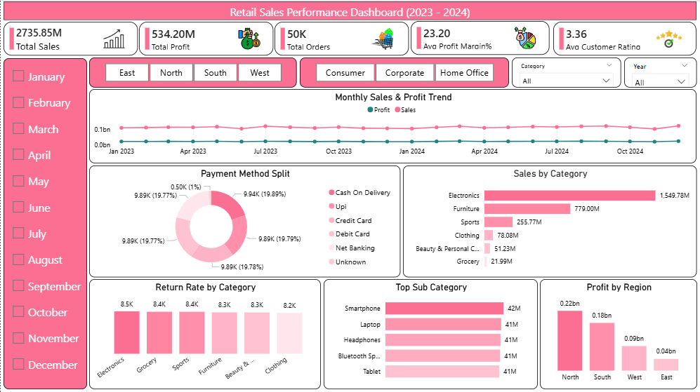

# Retail Sales Performance Analysis

## Project Overview
Analyzed 50,000+ retail orders (2023-2024) to uncover sales, profit, and customer behavior insights using Python, SQL, and Power BI.

## Problem Statement
Which categories, regions, and customer segments drive the most revenue and profit, and where are the biggest operational gaps (returns, delivery delays)?

## Tools Used
- Python (Pandas, NumPy, Matplotlib)
- SQL Server
- Power BI

## Project Structure

```
retail_sales_performance_analysis/
├── dataset/
│   ├── retail_sales_performance_raw.csv
│   └── cleaned_data.csv
├── notebooks/
│   └── retail_sales_performance_analysis.ipynb
├── sql/
│   └── business_questions.sql
├── dashboard/
│   └── retail_sales_performance_dashboard.pbix
├── screenshots/
│   └── dashboard_preview.png
└── README.md
```

## Dataset Information
Dataset Size: 50,000 records | 22 columns | Jan 2023 - Dec 2024

## Data Cleaning Steps
- Removed duplicate records (~300 rows)
- Standardized 4 different date formats into one
- Fixed inconsistent text casing across Category/Payment_Method
- Handled missing values across 7 columns
- Corrected invalid negative quantities and impossible discount values

## SQL Business Questions Solved
1. Monthly sales & profit trend
2. Category-wise sales and profit
3. Top 10 sub-categories by profit
4. Region/state contribution to revenue
5. Most preferred payment method
6. Most profitable customer segment
7. Return rate by category
8. Average delivery days by ship mode
9. Top 5 cities by average customer rating
10. Discount band impact on profit margin

## Dashboard Preview



### KPI Cards
- Total Sales
- Total Profit
- Total Orders
- Avg Profit Margin %
- Avg Customer Rating

### Charts
- Monthly Sales & Profit Trend (Line Chart)
- Payment Method Split (Donut Chart)
- Sales by Category (Bar Chart)
- Return Rate by Category (Column Chart)
- Top Sub Category by Profit (Bar Chart)
- Profit by Region (Column Chart)

### Filters/Slicers
- Month
- Region
- Segment
- Category
- Year

## Key Insights
- Electronics contributed Rs. 1,549.78M of total profit
- North region generated Rs. 0.22bn in total sales
- Cash on Delivery was the most used payment method at 19.89%

## How to Reproduce
1. Clone this repository
2. Run notebooks/retail_sales_performance_analysis.ipynb to generate the cleaned dataset
3. Load cleaned_data.csv into SQL Server, run sql/business_questions.sql
4. Open dashboard/retail_sales_performance_dashboard.pbix in Power BI Desktop

## Author
Sushil Kumar | Aspiring Data Analyst | Skills: Python, SQL, Power BI, Excel
